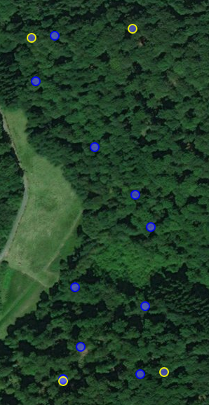

# UM2UAV
Planing and analysing UAV data

Parts of this repository should eventually be merged with the uavRmp and uavRst packages.

ToDo:

- Buffer the area
- Transform to JSON for parsing to uavRmp mission planing
- Include Take Off Point
- Include Flight direction (long or short side)
